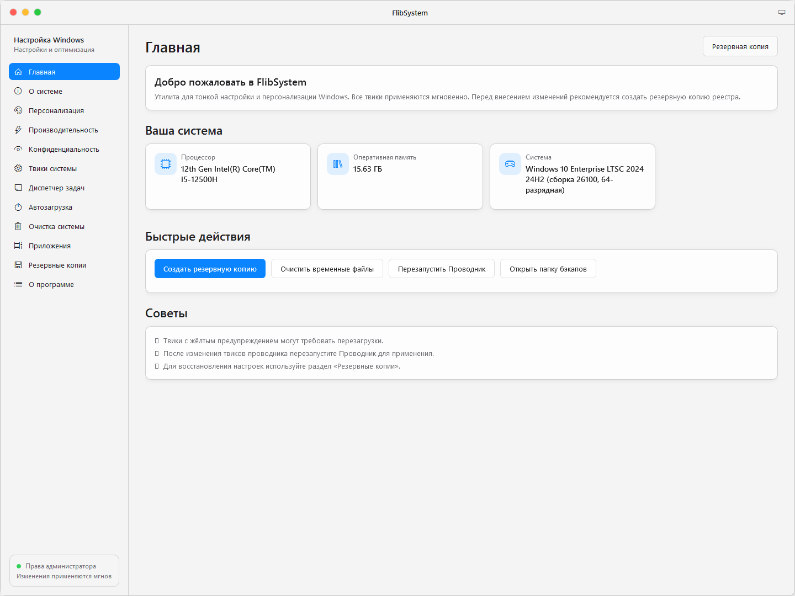
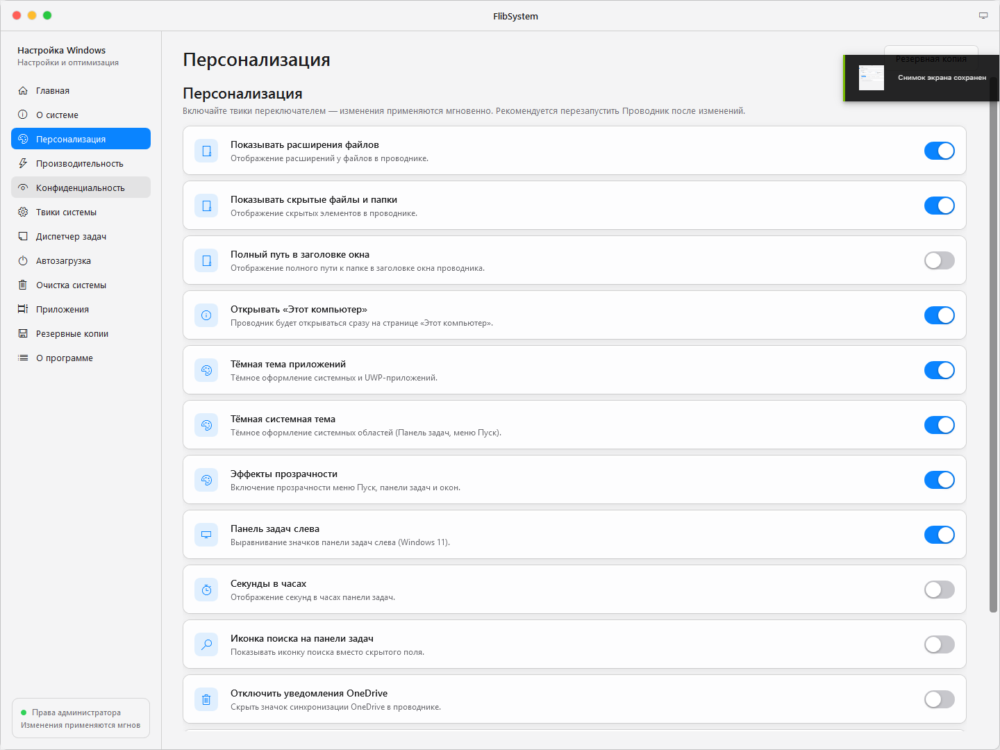
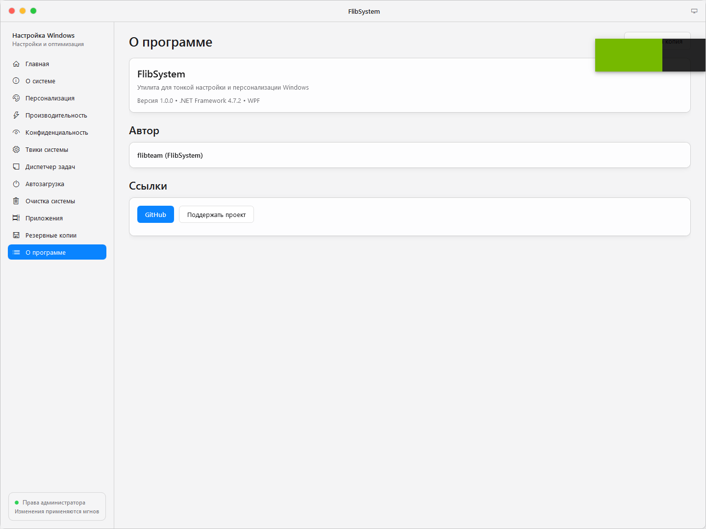
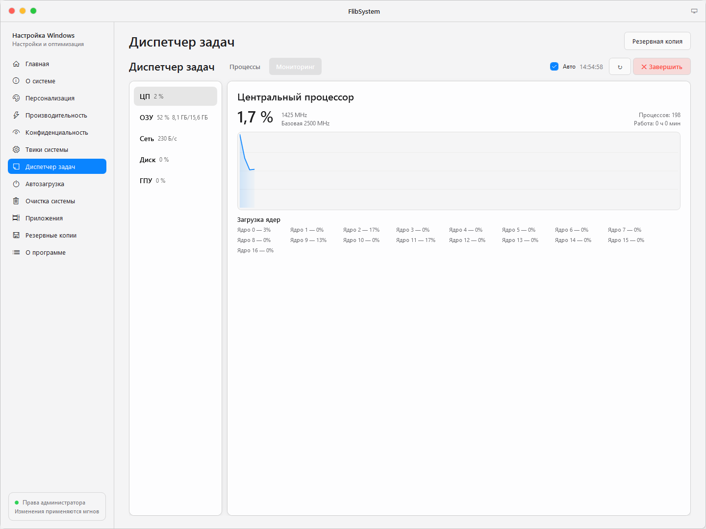

# FlibSystem

Утилита для тонкой настройки и персонализации Windows. Все твики применяются мгновенно, в один клик переключателем — без командной строки и ручной правки реестра.



## Возможности

- **Главная** — сводка о системе и быстрые действия (создать бэкап реестра, очистить временные файлы, перезапустить Проводник).
- **О системе** — подробная информация: ОС, процессор, память, видеокарта, материнская плата, накопители, сеть.
- **Персонализация** — твики внешнего вида: старый контекстное меню, тёмная тема, иконки рабочего стола и др.
- **Производительность** — оптимизация Windows: схема питания «Максимальная производительность», отключение анимаций, GameDVR и др.
- **Конфиденциальность** — отключение телеметрии, рекламы и слежки приложений.
- **Твики системы** — прочие настройки: ускорение выключения, параметры Проводника и др.
- **Диспетчер задач** — список процессов с нагрузкой ЦП/памяти и вкладка «Мониторинг» с живыми графиками ЦП, ОЗУ, сети, диска и ГПУ.
- **Автозагрузка** — управление программами, запускающимися вместе с Windows.
- **Очистка системы** — удаление временных файлов и мусора.
- **Приложения** — управление встроенными приложениями Windows (UWP).
- **Резервные копии** — создание и восстановление резервных копий реестра перед изменениями.
- **О программе** — ссылки на GitHub автора и поддержку проекта.

Все твики включаются мгновенно и применяются сразу. Твики с жёлтым предупреждением могут снижать безопасность или требовать перезагрузки..

## Требования

- Windows 10 / Windows 11
- .NET Framework 4.7.2 или выше (устанавливается вместе с Windows)
- права администратора (приложение само проверяет и запрашивает)

## Установка и запуск

1. Скачайте последний релиз (или соберите из исходников, см. ниже).
2. Запустите `FlibSystem.exe` от имени администратора.
3. Перед экспериментальными изменениями создайте резервную копию реестра на вкладке «Резервные копии».

## Сборка из исходников

Проект: C# / WPF, .NET Framework 4.7.2, Visual Studio 2019/2022.

```bat
msbuild src\FlibSystem.csproj /t:Rebuild /p:Configuration=Release /p:Platform=AnyCPU
```

Готовый файл появится в `src\bin\Release\FlibSystem.exe`.

## Скриншоты








## Поддержка

- GitHub: [github.com/flibteam](https://github.com/flibteam)
- Поддержать проект: [donationalerts.com/r/jannirobot](https://www.donationalerts.com/r/jannirobot)
- Telegram: https://t.me/flibteam

## Предупреждение

Программа вносит изменения в системный реестр Windows. Используйте на свой страх и риск: перед применением рекомендуется создать резервную копию. Некоторые твики отключают часть системной телеметрии и могут нарушать условия лицензии Windows.
